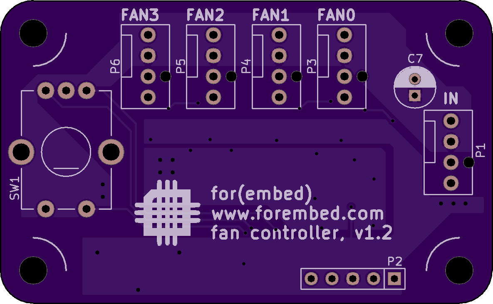

# Purpose #

This repository is for the hardware and firmware for a PC fan controller.  The
controller is intended to allow the user to multi-plex a single motherboard
output so that it may control up to 4 additional fans.  The project will feature:

 * Up to 4 outputs
 * Motherboard-controlled outputs for each with user speed scaling
 * Soft-start to reduce load on the motherboard
 * Speed control for each fan when a motherboard speed signal is not present
 
Details of the project may be found at [for(embed)](http://www.forembed.com/category/fan-controller.html).
 
# Project Status #

Firmware for v1.2 (optional thermistor control) is under development.

Firmware for v1.1 is complete!  Testing has been completely successful!

